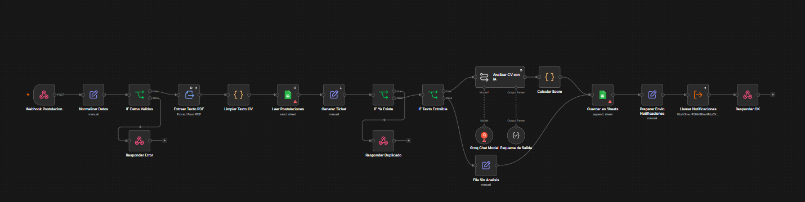
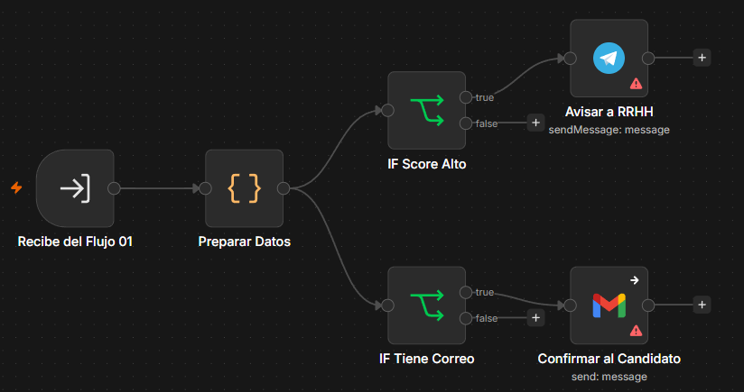
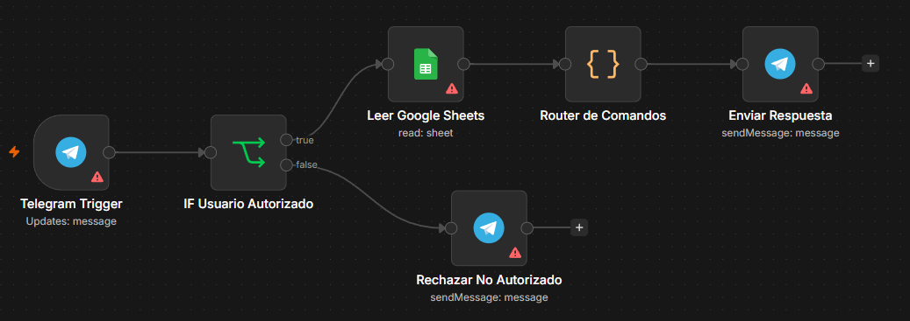
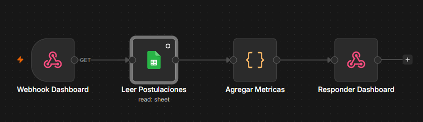

# TalentFlow — Formulario de postulación

Frontend del sistema de preselección de candidatos. Recopila los datos del
candidato y su hoja de vida en PDF, y los envía a un webhook de n8n.

```
Candidato → Formulario web → POST multipart → Webhook n8n → … → Google Sheets
```

# Explicacion Funciones y Creación

## 1. Arquitectura

```
CANDIDATO
   │
   ▼
FORMULARIO WEB (index.html)
   │  POST multipart/form-data
   ▼
WEBHOOK n8n (Postulación)
   │
   ├─ Extraer texto del PDF
   ├─ Analizar CV con IA (Groq / LangChain)
   ├─ Calcular Score de Compatibilidad (0-100)
   ├─ Guardar en Google Sheets
   └─ Llamar subworkflow
        │
        ├─ Telegram a RRHH (si score alto)
        └─ Gmail al candidato (confirmación, sin score)

BOT DE TELEGRAM                        DASHBOARD 
   │ /candidato /pendientes /stats     │ Webhook GET → agrega métricas
   ▼                                   ▼
   Lee Google Sheets                    Lee Google Sheets (sin PII)
```

**Componentes:**

| Componente | Tecnología |
|---|---|
| Formulario web | HTML + CSS + JS |
| Dashboard | HTML + CSS + JS  |
| Automatización | n8n  |
| IA de análisis de CV | Groq (modelo `qwen/qwen3.6-27b`) vía LangChain |
| Almacenamiento | Google Sheets |
| Notificaciones | Telegram Bot API + Gmail (OAuth2) |
| Consultas RRHH | Bot de Telegram |

---

## 2. Instalación


- Cuenta de n8n (self-hosted) con los nodos de LangChain habilitados.
- Cuenta de Google Cloud con Sheets API habilitada + credencial OAuth2.
- Cuenta de Groq con API Key.
- Bot de Telegram creado con [@BotFather](https://t.me/BotFather).
- Cuenta de Gmail con OAuth2 configurado para envío.
- Un túnel público para exponer n8n (en este proyecto: ngrok).

---

## 3. Configuración

Toda la configuración del frontend vive en dos archivos, **y solo ahí**:

| Archivo | Qué configura |
|---|---|
| `js/config.js` | URL del webhook de postulación, tamaño máximo de CV, timeout, lista de vacantes |
| `js/dashboard-config.js` | URL del webhook GET del dashboard, timeout |

> **Importante:** la URL del webhook de n8n se pega **únicamente en `js/config.js`** (`N8N_WEBHOOK_URL`). Lo mismo aplica al dashboard: la URL va solo en `dashboard-config.js`, nunca en `dashboard.js`.

---

## 4. Workflows de n8n

### Flujo 1

Recibe la postulación y hace todo el pipeline hasta guardar en Sheets, Cosas importantes que hace:

1. **Extraer Texto PDF** — extrae el texto del binario `cv`.
2. **Limpiar Texto CV** — repara texto con espaciado roto.
3. **Generar Ticket** — arma el `ID_Candidato` (`TF-YYYY-NNNN`) y marca `ya_existe` si el correo vacante ya está registrado.
4. **Calcular Score** — nodo de código que compara habilidades detectadas contra los requisitos de la vacante, calcula el score 0-100 y asigna estado/clasificación.
5. **Guardar en Sheets** — hace `append` de la fila completa.
6. **Preparar Envio Notificaciones** → **Llamar Notificaciones** — dispara el subworkflow (sin esperar su respuesta).





### Flujo 2 — Notificaciones 

Se ejecuta desde el Flujo 1. Recibe los datos ya guardados y:

- Si `es_prioritaria` (score ≥ 80) → envía mensaje HTML a un chat de Telegram fijo (RRHH).
- Si el candidato tiene correo válido → envía confirmación por Gmail, **sin score ni evaluación**, solo el número de ticket.



### Flujo 3 — Bot de Telegram

Trigger de Telegram + whitelist por `chatId`. Un único nodo de código actúa como router de comandos:

| Comando | Qué hace |
|---|---|
| `/candidato <ID>` | Ficha completa de un candidato buscado por `ID_Candidato` |
| `/pendientes` | Lista candidatos en estados `RECIBIDO`, `ANALIZADO` o `PENDIENTE_REVISION`, ordenados por score |
| `/stats` | Totales, promedio de score, conteo por estado y por vacante |
| `/help` | Lista de comandos |

Usuarios fuera del whitelist reciben un mensaje de rechazo.



### Flujo 4 — Dashboard (`flujo-dashboard-datos.json`)

Webhook `GET /dashboard-data` → lee Sheets → agrega métricas (por vacante, por estado, por fecha, distribución de score) → responde JSON. **Nunca** incluye nombre, correo ni teléfono; solo datos agregados/anonimizados.



---

## 5. Integraciones

| Servicio | Para qué | Dónde |
|---|---|---|
| **Google Sheets** | Base de datos centralizada de postulaciones | Flujos 1, 3, 4 |
| **Groq (LLM `qwen/qwen3.6-27b`)** | Análisis del texto del CV  | Flujo 1 |
| **Telegram Bot API** | Notificar a RRHH y atender comandos de consulta | Flujos 2 y 3 |
| **Gmail API (OAuth2)** | Confirmar al candidato la recepción de su postulación | Flujo 2 |
| **ngrok** | Exponer el n8n local a internet para recibir el webhook del formulario | Infraestructura |

---

## 6. Modelo de datos

Hoja de Google Sheets (`n9n`('n9n' fue el nombre escogido por el grupo para el sheets no es obligatorio), hoja `Hoja 1`), una fila por postulación:

| Columna | Tipo | Quién la llena | Descripción |
|---|---|---|---|
| `ID_Candidato` | texto | n8n | Ticket único `TF-YYYY-NNNN` |
| `Nombre` | texto | formulario | Nombre completo |
| `Correo` | texto | formulario | Correo (normalizado a minúsculas) |
| `Telefono` | texto | formulario | Teléfono de contacto |
| `Vacante` | texto (slug) | formulario | `backend-jr`, `frontend-jr` o `data-jr` |
| `Experiencia` | número | formulario / IA | Años de experiencia (declarada o detectada por IA si es mayor a 0) |
| `Habilidades` | texto | IA | Lista separada por comas, en minúsculas y sin tildes |
| `Nivel_Educativo` | texto | IA | `Bachiller`, `Tecnico`, `Profesional`, `Posgrado` o `No definido` |
| `Score_Compatibilidad` | número (0-100) | n8n (fórmula) | Ver fórmula abajo. Vacío si el PDF no tenía texto legible |
| `Estado` | texto | n8n (fórmula) | `PRESELECCIONADO`, `ANALIZADO` o `PENDIENTE_REVISION` |
| `Fecha_Postulacion` | texto (ISO) | n8n | Fecha y hora de la postulación |
| `Observaciones_IA` | texto | n8n (fórmula) + IA | Resumen de requisitos cumplidos/faltantes + resumen de la IA |
| `Revision_RRHH` | texto | RRHH (manual) | Columna para que RRHH complete a mano el resultado de su revisión |

Clasificación resultante:

| Score | Estado | Clasificación |
|---|---|---|
| ≥ 80 | `PRESELECCIONADO` | Revisión prioritaria |
| 60–79 | `ANALIZADO` | Revisión manual |
| < 60 | `PENDIENTE_REVISION` | Revisión secundaria |
| Sin score (PDF ilegible) | `PENDIENTE_REVISION` | Revisión manual — PDF no legible |

Requisitos por vacante (definidos en código, no en Sheets):

| Vacante | Requisitos | Experiencia mínima |
|---|---|---|
| `backend-jr` | java, spring boot, sql, git, rest api | 1 año |
| `frontend-jr` | javascript, react, css, html, git | 1 año |
| `data-jr` | sql, python, power bi, excel, etl | 1 año |


---

## 8. Prompts utilizados

### Prompt de análisis de CV (nodo "Analizar CV con IA", Groq)

Instrucciones clave dadas al modelo:

- Advertencia explícita de que el texto viene de extracción automática de PDF y puede traer errores de formato (espaciado entre letras, columnas mezcladas).
- Regla de no inventar: solo reportar habilidades, empresas o títulos que aparezcan literalmente en el texto.
- Prohibición explícita de usar o mencionar género, edad, fotografía, estado civil, nacionalidad, religión, orientación sexual o discapacidad.
- Habilidades siempre en minúsculas y sin tildes.
- Buscar la lista de habilidades cerca de encabezados típicos (`HABILIDADES`, `SKILLS`, `TECNOLOGIAS`, `CONOCIMIENTOS`), aunque estén mal formateados.
- Si un dato no aparece, usar `"No definido"` o lista vacía — nunca adivinar.
- Recibe la vacante y el texto completo del CV como variables.

**Salida forzada por Structured Output Parser** (JSON):

```json
{
  "experiencia_anios": number,
  "habilidades": string[],
  "nivel_educativo": "Bachiller" | "Tecnico" | "Profesional" | "Posgrado" | "No definido",
  "resumen": string,
  "preguntas_sugeridas": string[]
}
```

La IA **extrae**; el score y la clasificación los calcula un nodo de código con una fórmula fija y reproducible — separación deliberada para que la decisión sensible no dependa de la IA.

---

## 9. Pruebas realizadas

| # | Caso de prueba | Resultado |
|---|---|---|
| 1 | Postulación válida completa (PDF con texto legible) → llega a Sheets con score calculado | ✅ Confirmado con una postulación real |
| 2 | Dashboard carga datos reales desde Sheets (agregados, sin PII) | ✅ Confirmado en navegador, pestaña limpia |
| 3 | Dashboard sigue funcionando tras cambiar de URL de prueba a producción | ✅ Confirmado |
| 4 | Postulación en modo producción (`/webhook/postulacion`) | 🔴 Pendiente |
| 5 | Detección de duplicado (correo + vacante repetidos → `409`) | 🔴 Pendiente |
| 6 | PDF sin texto (escaneado o vacío) → fila sin análisis, estado pendiente | ✅ Confirmado |
| 7 | Envío de notificación a Telegram (score alto) | ✅ Confirmado |
| 8 | Envío de confirmación por Gmail al candidato | ✅ Confirmado |


